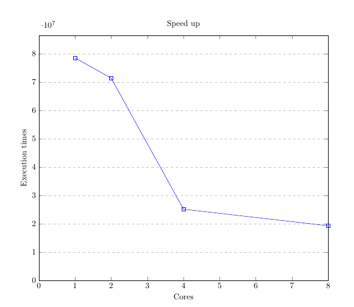
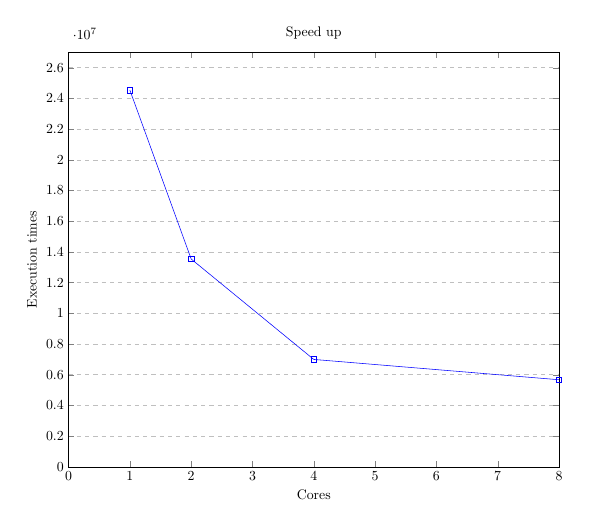
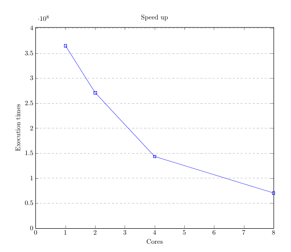
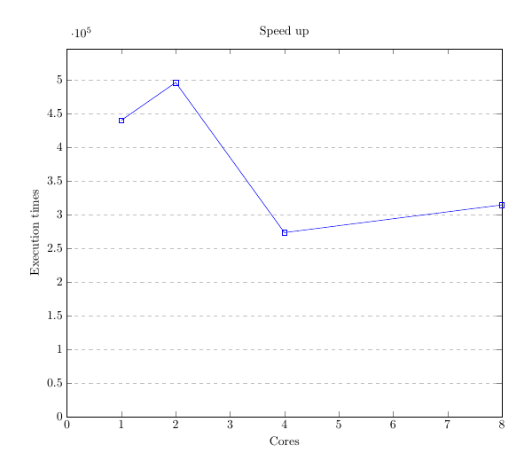

Concurrent and Distributed Programming  
===  

Problem Set:   
**11th Marathon of Parallel Programming Contest** [[WSCAD-2016](http://lspd.mackenzie.br/marathon/16/problems.html)]  

* Sequential code (c/c++) and judge input/output taken from *WSCAD-2016*  
* Some minor bug of sequential code is fixed (eg: game-of-life input reading, histogram input format)   

---

## Used Programming Language: `GO`

## Problems:

* [Game of Life](./game-of-life)   
* [Histogram](./histogram)  
* [String-parsing](./string-parsing)   
* [Sudokount](./sudokount)    

## Performance Evaluation:  

Game-of-life   |   Histogram
:--------:|:-----------:
 |    

Sudokount   |   String-parsing
:--------:|:-----------:
 |      

## Benchmarking Tool:  

For evaluating the performance of this solutions I have used an excellent benchmarking tool 
developed by *Franz* using `rust`. See details [here](https://github.com/fzgregor/cds-lab-2017)  

 

